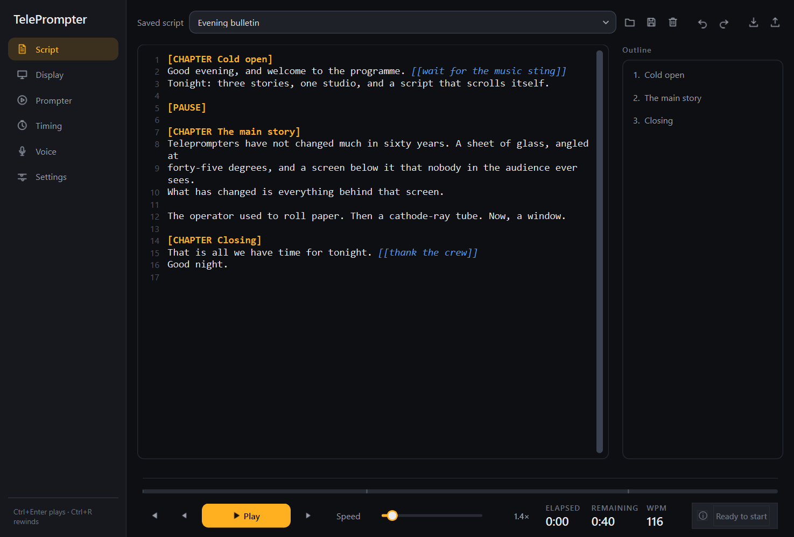
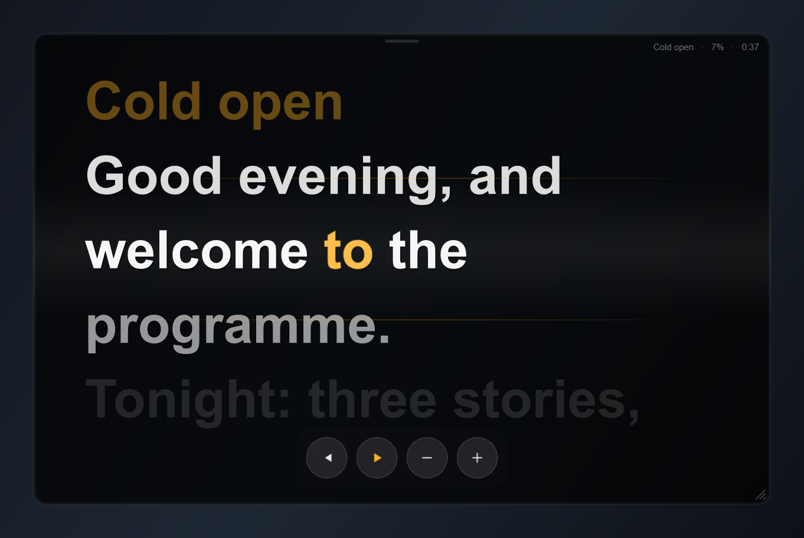
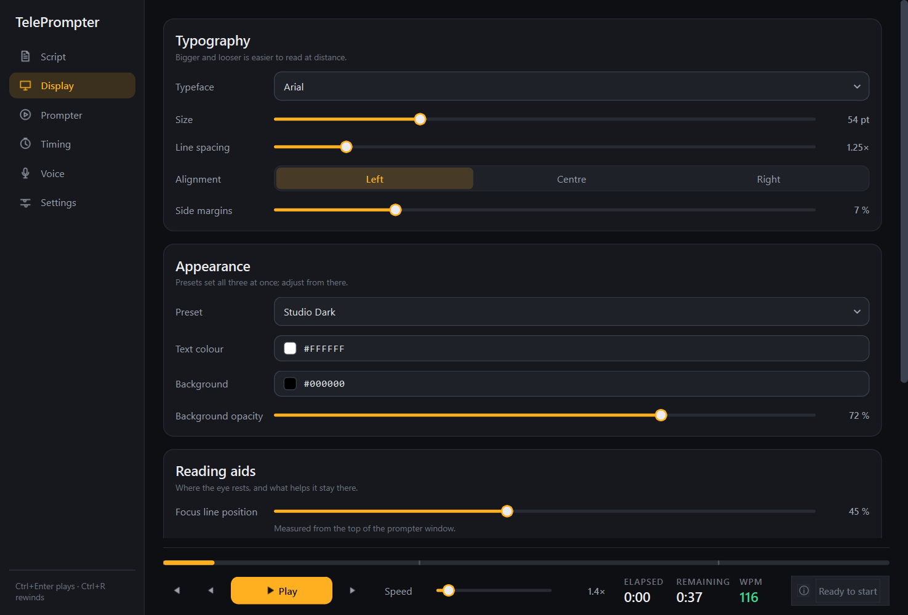
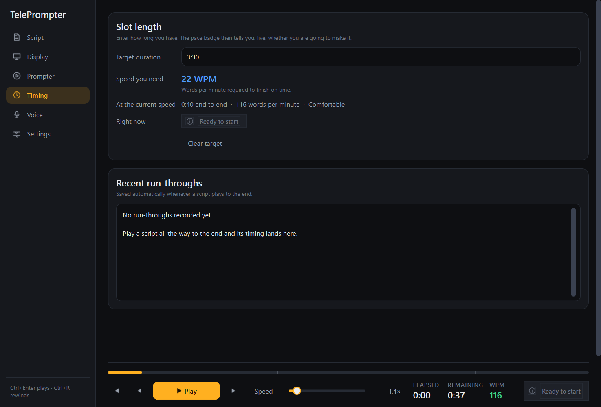
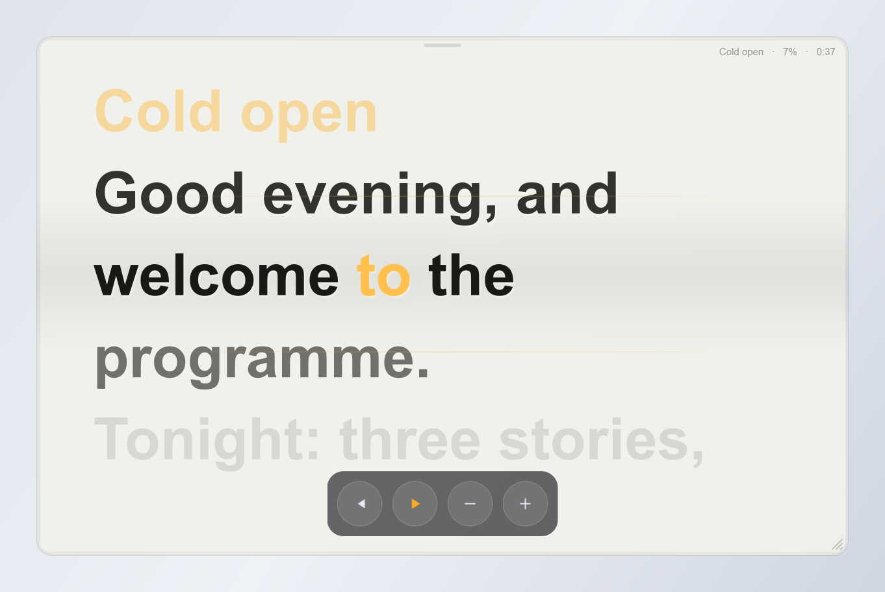
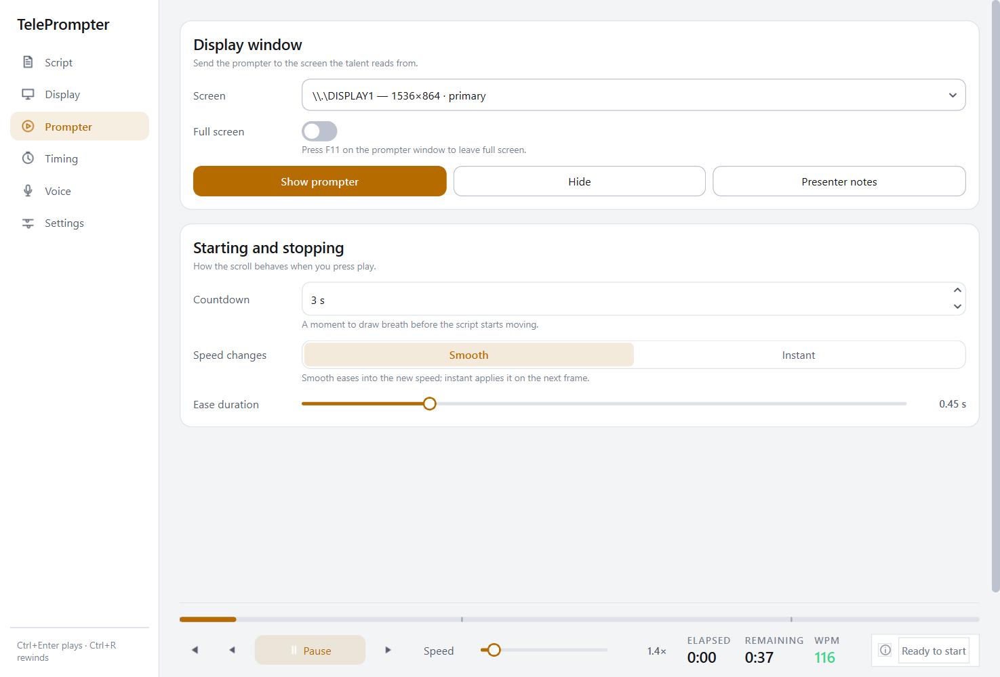

<a id="top"></a>top

# TelePrompter

**A studio-grade teleprompter that runs on your own machine.**

[](https://github.com/IACBI/teleprompter/actions/workflows/ci.yml)
[](https://github.com/IACBI/teleprompter/releases/latest)


[](LICENSE)


**Read this in:** [English](#english) · [Türkçe](#türkçe) · [中文](#中文) · [हिन्दी](#हिन्दी) · [Español](#español) · [العربية](#العربية) · [Português](#português) · [Русский](#русский)

|  |  |
|---|---|
|  |  |
|  |  |
|  |  |

---

<a id="english"></a>english

## English

### Overview

TelePrompter is a desktop teleprompter for people who read to a camera: a
translucent, always-on-top display window that can be sent full screen to the
monitor mounted on the rig, and a control panel that stays out of the way until
you need it.

It scrolls at a rate you set, in real time rather than per frame, so the pace is
identical whether your display runs at 60 Hz or 144 Hz. It knows how long your
script will take, tells you live whether you are going to overrun, stops itself
at the points you mark, and keeps your private notes off the glass.

There is no account, no cloud and no network code. Everything stays on your
machine.

### Features

| | |
|---|---|
| **Display** | Translucent always-on-top overlay · adjustable opacity · send to any connected screen · full screen · horizontal and vertical mirroring for beam-splitter glass |
| **Reading** | Distance fade around a focus band · per-word highlight that sweeps as you read · adjustable focus line position · six colour presets or your own |
| **Scrolling** | Real-time pacing, frame-rate independent · smooth speed ramping or instant · voice-activated pausing · countdown before playback |
| **Script tags** | `[PAUSE]` to stop · `[CHAPTER Title]` to navigate · `[[note]]` for notes only you see |
| **Navigation** | Chapter outline beside the editor · click-to-seek progress bar with chapter ticks · previous / next chapter |
| **Timing** | Enter your slot length and see the words-per-minute you need · live ahead / on-track / behind badge · per-chapter rehearsal history |
| **Editor** | Line numbers · tag syntax highlighting · the line being read is marked as it scrolls |
| **Files** | Import `.txt` in any encoding and `.pdf` · export a printable PDF · named script slots · automatic saving |
| **Interface** | Full dark and light themes · vector icons · every control keyboard reachable and named for screen readers |
| **Safety** | Atomic saves with a backup generation · periodic autosave · rotating log file · a crash tells you where to look |

### Requirements

- Python 3.10 or newer
- PySide6 (installed automatically)

Three optional extras unlock optional features:

| Package | Unlocks |
|---|---|
| `keyboard` | Global shortcuts that work while another application has focus |
| `sounddevice numpy` | Voice-activated scrolling |
| `PyMuPDF` | Importing text from PDF files |

### Installation

**Windows, no Python needed:** download `TelePrompter.exe` from the [latest release](https://github.com/IACBI/teleprompter/releases/latest).

From source:

```bash
pip install .
```

With everything optional included:

```bash
pip install ".[all]"
```

For development:

```bash
pip install -e ".[dev]"
```

### Usage

```bash
teleprompter
```

Two windows open side by side: the control panel on the left, the prompter on
the right. Type or import a script, press **Play**, and drag the strip along the
top of the prompter to position it.

To use it with a camera rig, open the **Prompter** page, pick the screen your
prompter monitor is on, and switch on full screen. If the script is reflected off
beam-splitter glass, turn on mirroring under **Display → Reading aids**.

Tag your script as you write it:

```
[CHAPTER Cold open]
Good evening, and welcome to the programme. [[wait for the music sting]]

[PAUSE]

[CHAPTER The main story]
Our first report comes from the north of the country.
```

More detail: [script tags](docs/script-tags.md) ·
[keyboard shortcuts](docs/keyboard.md)

### Configuration

Everything is set in the application; there is no configuration file to edit by
hand. Settings, saved scripts and rehearsal history are written to a single
`state.json`, which you can open from **Settings → Diagnostics** along with the
log folder.

Two features reach outside the application window and both are **off until you
turn them on**: global shortcuts, which install a system-wide keyboard hook, and
voice detection, which opens the microphone. What each one does, and what it
does not do, is set out in [privacy and system access](docs/privacy.md).

### Contributing

The engine is deliberately free of Qt, so most changes can be made and tested
without opening a window. Start with [architecture](docs/architecture.md).

```bash
pip install -e ".[dev]"
ruff check . && ruff format --check .
mypy src/teleprompter/core src/teleprompter/storage
pytest -q
```

Please add a test alongside any behaviour change. Bug reports are most useful
with the script that triggered them and the log file from **Settings →
Diagnostics**.

### License

MIT — see [LICENSE](LICENSE). Author: 𝓐.𝓒.𝓑

[⬆ Back to top](#top)

---

<a id="türkçe"></a>türkçe

## Türkçe

### Genel bakış

TelePrompter, kameraya karşı metin okuyanlar için bir masaüstü teleprompter'ı:
saydam, her zaman üstte duran bir gösterim penceresi — çekim düzeneğine monte
edilmiş ekrana tam ekran gönderilebilir — ve ihtiyaç duyana kadar yolunuza
çıkmayan bir kontrol paneli.

Kaydırma, kare başına değil gerçek zamana göre yapılır; ekranınız 60 Hz de olsa
144 Hz de olsa tempo birebir aynı kalır. Metninizin ne kadar süreceğini bilir,
süreyi aşıp aşmayacağınızı anlık olarak söyler, işaretlediğiniz noktalarda
kendiliğinden durur ve özel notlarınızı camdan uzak tutar.

Hesap yok, bulut yok, ağ kodu yok. Her şey sizin makinenizde kalır.

### Özellikler

| | |
|---|---|
| **Gösterim** | Saydam, her zaman üstte bindirme · ayarlanabilir opaklık · bağlı herhangi bir ekrana gönderme · tam ekran · beam-splitter cam için yatay ve dikey ayna |
| **Okuma** | Odak bandı çevresinde uzaklık solması · okudukça süzülen kelime vurgusu · ayarlanabilir odak çizgisi konumu · altı renk hazır ayarı veya kendinizinki |
| **Kaydırma** | Kare hızından bağımsız gerçek zamanlı tempo · yumuşak hız rampası veya anında · sesle tetiklenen duraklatma · oynatmadan önce geri sayım |
| **Script etiketleri** | Durdurmak için `[PAUSE]` · gezinmek için `[CHAPTER Başlık]` · yalnızca sizin gördüğünüz `[[not]]` |
| **Gezinme** | Editörün yanında bölüm listesi · bölüm işaretli, tıklanabilir ilerleme çubuğu · önceki / sonraki bölüm |
| **Zamanlama** | Süre kutunuzu girin, gereken dakikada kelimeyi görün · canlı önde / hedefte / geride rozeti · bölüm bazlı prova geçmişi |
| **Editör** | Satır numaraları · etiket renklendirme · okunan satır kaydırma sırasında işaretlenir |
| **Dosyalar** | Her kodlamada `.txt` ve `.pdf` içe aktarma · yazdırılabilir PDF dışa aktarma · adlandırılmış script yuvaları · otomatik kayıt |
| **Arayüz** | Eksiksiz koyu ve açık temalar · vektör ikonlar · her denetim klavyeyle erişilebilir ve ekran okuyucular için adlandırılmış |
| **Güvenlik** | Yedek kuşaklı atomik kayıt · periyodik otomatik kayıt · döngüsel log dosyası · çökme durumunda nereye bakacağınızı söyler |

### Gereksinimler

- Python 3.10 veya üzeri
- PySide6 (otomatik kurulur)

Üç isteğe bağlı paket, isteğe bağlı özellikleri açar:

| Paket | Açtığı özellik |
|---|---|
| `keyboard` | Başka bir uygulama odaktayken de çalışan global kısayollar |
| `sounddevice numpy` | Sesle tetiklenen kaydırma |
| `PyMuPDF` | PDF dosyalarından metin içe aktarma |

### Kurulum

**Windows, Python gerekmez:** [son sürümden](https://github.com/IACBI/teleprompter/releases/latest) `TelePrompter.exe` dosyasını indirin.

Kaynaktan:

```bash
pip install .
```

İsteğe bağlı her şey dahil:

```bash
pip install ".[all]"
```

Geliştirme için:

```bash
pip install -e ".[dev]"
```

### Kullanım

```bash
teleprompter
```

Yan yana iki pencere açılır: solda kontrol paneli, sağda prompter. Metninizi
yazın veya içe aktarın, **Play**'e basın ve prompter'ı konumlandırmak için üst
kenarındaki şeridi sürükleyin.

Kamera düzeneğiyle kullanmak için **Prompter** sayfasını açın, prompter
monitörünüzün bulunduğu ekranı seçin ve tam ekranı açın. Metin beam-splitter
camdan yansıtılıyorsa **Display → Reading aids** altından aynayı etkinleştirin.

Metninizi yazarken etiketleyin:

```
[CHAPTER Açılış]
İyi akşamlar, programımıza hoş geldiniz. [[müzik girene kadar bekle]]

[PAUSE]

[CHAPTER Ana haber]
İlk haberimiz ülkenin kuzeyinden geliyor.
```

Ayrıntı: [script etiketleri](docs/script-tags.md) ·
[klavye kısayolları](docs/keyboard.md)

### Yapılandırma

Her şey uygulama içinden ayarlanır; elle düzenlenecek bir yapılandırma dosyası
yoktur. Ayarlar, kayıtlı scriptler ve prova geçmişi tek bir `state.json` içine
yazılır; bu dosyayı log klasörüyle birlikte **Settings → Diagnostics**
üzerinden açabilirsiniz.

İki özellik uygulama penceresinin dışına uzanır ve ikisi de **siz açana kadar
kapalıdır**: sistem geneli klavye kancası kuran global kısayollar ve mikrofonu
açan ses algılama. Her birinin ne yaptığı ve ne yapmadığı
[gizlilik ve sistem erişimi](docs/privacy.md) belgesinde açıkça yazılıdır.

### Katkıda bulunma

Motor bilinçli olarak Qt'den bağımsızdır; bu yüzden değişikliklerin çoğu bir
pencere açmadan yapılıp test edilebilir. [Mimari](docs/architecture.md) ile
başlayın.

```bash
pip install -e ".[dev]"
ruff check . && ruff format --check .
mypy src/teleprompter/core src/teleprompter/storage
pytest -q
```

Davranış değiştiren her değişikliğin yanına lütfen bir test ekleyin. Hata
bildirimleri, sorunu tetikleyen script ve **Settings → Diagnostics**'ten alınan
log dosyasıyla birlikte en yararlı hâle gelir.

### Lisans

MIT — bkz. [LICENSE](LICENSE). Yapımcı: 𝓐.𝓒.𝓑

[⬆ Başa dön](#top)

---

<a id="中文"></a>中文

## 中文

### 概览

TelePrompter 是一款面向出镜念稿者的桌面提词器：一个半透明、始终置顶的显示窗口，
可以全屏发送到装在机位上的那块监视器；再加上一个不用时不碍事的控制面板。

滚动按真实时间推进，而不是按帧推进，因此无论显示器是 60 Hz 还是 144 Hz，节奏都
完全一致。它知道你的稿子要念多久，实时告诉你会不会超时，在你标记的位置自动停下，
并把私人提示留在玻璃之外。

无需账号，没有云端，也没有任何联网代码。一切都留在你自己的机器上。

### 功能

| | |
|---|---|
| **显示** | 半透明置顶浮层 · 不透明度可调 · 发送到任意已连接的屏幕 · 全屏 · 为分光镜提供水平与垂直镜像 |
| **阅读** | 聚焦带周围的距离淡出 · 随读随扫的逐词高亮 · 聚焦线位置可调 · 六套配色预设或自定义 |
| **滚动** | 与帧率无关的实时节奏 · 平滑变速或即时变速 · 语音触发暂停 · 播放前倒计时 |
| **稿件标记** | `[PAUSE]` 停止 · `[CHAPTER 标题]` 导航 · `[[提示]]` 只有你能看到 |
| **导航** | 编辑器旁的章节大纲 · 带章节刻度、可点击跳转的进度条 · 上一章 / 下一章 |
| **计时** | 输入时长，立即看到所需的每分钟词数 · 实时显示领先 / 正常 / 落后 · 按章节记录的排练历史 |
| **编辑器** | 行号 · 标记语法高亮 · 正在念的那一行随滚动标出 |
| **文件** | 导入任意编码的 `.txt` 与 `.pdf` · 导出可打印的 PDF · 具名稿件槽位 · 自动保存 |
| **界面** | 完整的深色与浅色主题 · 矢量图标 · 每个控件均可键盘操作并为读屏软件命名 |
| **安全** | 带备份代的原子保存 · 定期自动保存 · 轮转日志文件 · 崩溃时会告诉你去哪里查看 |

### 环境要求

- Python 3.10 或更高版本
- PySide6（自动安装）

三个可选依赖用于解锁可选功能：

| 依赖 | 解锁功能 |
|---|---|
| `keyboard` | 其他程序处于焦点时仍然有效的全局快捷键 |
| `sounddevice numpy` | 语音触发滚动 |
| `PyMuPDF` | 从 PDF 文件导入文本 |

### 安装

**Windows，无需 Python：**从[最新发行版](https://github.com/IACBI/teleprompter/releases/latest)下载 `TelePrompter.exe`。

从源码安装：

```bash
pip install .
```

包含全部可选功能：

```bash
pip install ".[all]"
```

用于开发：

```bash
pip install -e ".[dev]"
```

### 使用

```bash
teleprompter
```

两个窗口并排打开：左边是控制面板，右边是提词器。输入或导入稿件，按 **Play**，
拖动提词器顶部的横条来摆放位置。

配合机位使用时，打开 **Prompter** 页面，选择提词监视器所在的屏幕并开启全屏。
如果稿件是经分光镜反射的，请在 **Display → Reading aids** 中开启镜像。

写稿时顺手加上标记：

```
[CHAPTER 开场]
晚上好，欢迎收看本期节目。 [[等片头音乐结束]]

[PAUSE]

[CHAPTER 头条]
第一条报道来自这个国家的北部。
```

更多细节：[稿件标记](docs/script-tags.md) · [键盘快捷键](docs/keyboard.md)

### 配置

一切都在程序内设置，没有需要手工编辑的配置文件。设置、已保存的稿件和排练历史都写入
同一个 `state.json`，可以在 **Settings → Diagnostics** 中连同日志文件夹一起打开。

有两项功能会伸到程序窗口之外，并且**在你打开之前都是关闭的**：安装系统级键盘钩子的
全局快捷键，以及会打开麦克风的语音检测。它们分别做什么、不做什么，都写在
[隐私与系统访问](docs/privacy.md)中。

### 参与贡献

引擎刻意不依赖 Qt，因此大多数改动无需打开窗口即可完成与测试。请从
[架构说明](docs/architecture.md)开始。

```bash
pip install -e ".[dev]"
ruff check . && ruff format --check .
mypy src/teleprompter/core src/teleprompter/storage
pytest -q
```

改动行为时请一并补上测试。提交问题报告时，附上触发问题的稿件和
**Settings → Diagnostics** 中的日志文件最有帮助。

### 许可证

MIT — 见 [LICENSE](LICENSE)。作者：𝓐.𝓒.𝓑

[⬆ 回到顶部](#top)

---

<a id="हिन्दी"></a>हिन्दी

## हिन्दी

### परिचय

TelePrompter उन लोगों के लिए एक डेस्कटॉप टेलीप्रॉम्प्टर है जो कैमरे के सामने
स्क्रिप्ट पढ़ते हैं: एक पारभासी, हमेशा सबसे ऊपर रहने वाली डिस्प्ले विंडो — जिसे
रिग पर लगे मॉनिटर पर पूर्ण स्क्रीन भेजा जा सकता है — और एक कंट्रोल पैनल जो
ज़रूरत पड़ने तक रास्ते से हटा रहता है।

स्क्रॉलिंग फ़्रेम के हिसाब से नहीं, वास्तविक समय के हिसाब से चलती है, इसलिए
आपका डिस्प्ले 60 Hz पर चले या 144 Hz पर, गति बिल्कुल एक जैसी रहती है। यह जानता
है कि आपकी स्क्रिप्ट कितनी लंबी चलेगी, लाइव बताता है कि आप समय से आगे निकलेंगे
या पीछे रहेंगे, आपके चिह्नित बिंदुओं पर अपने आप रुकता है, और आपके निजी नोट्स
काँच से दूर रखता है।

कोई अकाउंट नहीं, कोई क्लाउड नहीं, कोई नेटवर्क कोड नहीं। सब कुछ आपकी मशीन पर
ही रहता है।

### विशेषताएँ

| | |
|---|---|
| **डिस्प्ले** | पारभासी, हमेशा ऊपर रहने वाला ओवरले · समायोज्य अपारदर्शिता · किसी भी जुड़ी स्क्रीन पर भेजें · पूर्ण स्क्रीन · बीम-स्प्लिटर काँच के लिए क्षैतिज और लंबवत मिरर |
| **पठन** | फ़ोकस बैंड के चारों ओर दूरी के अनुसार धुँधलापन · पढ़ने के साथ बहता शब्द-हाइलाइट · फ़ोकस रेखा की समायोज्य स्थिति · छह रंग प्रीसेट या अपने |
| **स्क्रॉलिंग** | फ़्रेम-दर से स्वतंत्र वास्तविक-समय गति · सहज या तात्कालिक गति परिवर्तन · आवाज़ से नियंत्रित ठहराव · चलाने से पहले उलटी गिनती |
| **स्क्रिप्ट टैग** | रोकने के लिए `[PAUSE]` · नेविगेशन के लिए `[CHAPTER शीर्षक]` · केवल आपको दिखने वाला `[[नोट]]` |
| **नेविगेशन** | संपादक के बगल में अध्याय रूपरेखा · अध्याय-चिह्नित, क्लिक-करने-योग्य प्रगति पट्टी · पिछला / अगला अध्याय |
| **समय** | अपना स्लॉट समय डालें और आवश्यक शब्द-प्रति-मिनट देखें · लाइव आगे / सही / पीछे बैज · अध्यायवार रिहर्सल इतिहास |
| **संपादक** | पंक्ति संख्याएँ · टैग सिंटैक्स हाइलाइटिंग · पढ़ी जा रही पंक्ति स्क्रॉल के साथ चिह्नित |
| **फ़ाइलें** | किसी भी एन्कोडिंग में `.txt` और `.pdf` आयात · प्रिंट-योग्य PDF निर्यात · नामित स्क्रिप्ट स्लॉट · स्वतः सहेजना |
| **इंटरफ़ेस** | पूर्ण डार्क और लाइट थीम · वेक्टर आइकॉन · हर नियंत्रण कीबोर्ड से सुलभ और स्क्रीन रीडर के लिए नामित |
| **सुरक्षा** | बैकअप पीढ़ी के साथ परमाणु सहेजना · नियमित स्वतः सहेजना · घूर्णन लॉग फ़ाइल · क्रैश होने पर बताता है कहाँ देखें |

### आवश्यकताएँ

- Python 3.10 या नया
- PySide6 (स्वतः इंस्टॉल होता है)

तीन वैकल्पिक पैकेज वैकल्पिक सुविधाएँ खोलते हैं:

| पैकेज | क्या खोलता है |
|---|---|
| `keyboard` | ग्लोबल शॉर्टकट जो किसी और ऐप के फ़ोकस में होने पर भी काम करते हैं |
| `sounddevice numpy` | आवाज़ से नियंत्रित स्क्रॉलिंग |
| `PyMuPDF` | PDF फ़ाइलों से टेक्स्ट आयात |

### इंस्टॉलेशन

**Windows, Python की ज़रूरत नहीं:** [नवीनतम रिलीज़](https://github.com/IACBI/teleprompter/releases/latest) से `TelePrompter.exe` डाउनलोड करें।

स्रोत से:

```bash
pip install .
```

सभी वैकल्पिक सुविधाओं के साथ:

```bash
pip install ".[all]"
```

विकास के लिए:

```bash
pip install -e ".[dev]"
```

### उपयोग

```bash
teleprompter
```

दो विंडो साथ-साथ खुलती हैं: बाईं ओर कंट्रोल पैनल, दाईं ओर प्रॉम्प्टर। स्क्रिप्ट
लिखें या आयात करें, **Play** दबाएँ, और प्रॉम्प्टर को रखने के लिए उसके ऊपरी
किनारे की पट्टी को खींचें।

कैमरा रिग के साथ उपयोग के लिए **Prompter** पृष्ठ खोलें, वह स्क्रीन चुनें जिस पर
आपका प्रॉम्प्टर मॉनिटर है, और पूर्ण स्क्रीन चालू करें। यदि स्क्रिप्ट
बीम-स्प्लिटर काँच से परावर्तित होती है, तो **Display → Reading aids** में मिरर
चालू करें।

लिखते समय ही टैग लगाएँ:

```
[CHAPTER शुरुआत]
नमस्कार, कार्यक्रम में आपका स्वागत है। [[संगीत खत्म होने तक रुकें]]

[PAUSE]

[CHAPTER मुख्य समाचार]
हमारी पहली रिपोर्ट देश के उत्तर से आ रही है।
```

अधिक जानकारी: [स्क्रिप्ट टैग](docs/script-tags.md) ·
[कीबोर्ड शॉर्टकट](docs/keyboard.md)

### कॉन्फ़िगरेशन

सब कुछ ऐप के भीतर से सेट होता है; हाथ से संपादित करने के लिए कोई कॉन्फ़िगरेशन
फ़ाइल नहीं है। सेटिंग्स, सहेजी गई स्क्रिप्ट और रिहर्सल इतिहास एक ही
`state.json` में लिखे जाते हैं, जिसे आप लॉग फ़ोल्डर के साथ
**Settings → Diagnostics** से खोल सकते हैं।

दो सुविधाएँ ऐप विंडो के बाहर पहुँचती हैं और दोनों **आपके चालू करने तक बंद
रहती हैं**: ग्लोबल शॉर्टकट, जो सिस्टम-व्यापी कीबोर्ड हुक लगाते हैं, और आवाज़
पहचान, जो माइक्रोफ़ोन खोलती है। हर एक क्या करती है और क्या नहीं,
[गोपनीयता और सिस्टम पहुँच](docs/privacy.md) में स्पष्ट लिखा है।

### योगदान

इंजन जानबूझकर Qt से स्वतंत्र है, इसलिए अधिकांश बदलाव विंडो खोले बिना किए और
परखे जा सकते हैं। [आर्किटेक्चर](docs/architecture.md) से शुरू करें।

```bash
pip install -e ".[dev]"
ruff check . && ruff format --check .
mypy src/teleprompter/core src/teleprompter/storage
pytest -q
```

व्यवहार बदलने वाले हर बदलाव के साथ कृपया एक टेस्ट जोड़ें। बग रिपोर्ट तब सबसे
उपयोगी होती है जब उसमें समस्या पैदा करने वाली स्क्रिप्ट और
**Settings → Diagnostics** से लिया गया लॉग शामिल हो।

### लाइसेंस

MIT — देखें [LICENSE](LICENSE)। लेखक: 𝓐.𝓒.𝓑

[⬆ ऊपर जाएँ](#top)

---

<a id="español"></a>español

## Español

### Descripción general

TelePrompter es un teleprónter de escritorio para quien lee a cámara: una
ventana de visualización translúcida y siempre visible —que puede enviarse a
pantalla completa al monitor montado en el equipo— y un panel de control que no
estorba hasta que lo necesitas.

El desplazamiento avanza en tiempo real, no por fotograma, así que el ritmo es
idéntico tanto si tu pantalla va a 60 Hz como a 144 Hz. Sabe cuánto durará tu
guion, te dice en directo si vas a pasarte de tiempo, se detiene solo en los
puntos que marques y mantiene tus notas privadas fuera del cristal.

Sin cuenta, sin nube y sin código de red. Todo se queda en tu equipo.

### Características

| | |
|---|---|
| **Visualización** | Superposición translúcida siempre visible · opacidad ajustable · envío a cualquier pantalla conectada · pantalla completa · espejado horizontal y vertical para cristal divisor |
| **Lectura** | Desvanecido por distancia alrededor de una banda de enfoque · resaltado por palabra que avanza contigo · posición ajustable de la línea de enfoque · seis combinaciones de color o la tuya |
| **Desplazamiento** | Ritmo en tiempo real, independiente de la tasa de refresco · cambio de velocidad suave o inmediato · pausa activada por voz · cuenta atrás antes de empezar |
| **Etiquetas** | `[PAUSE]` para detener · `[CHAPTER Título]` para navegar · `[[nota]]` que solo ves tú |
| **Navegación** | Esquema de capítulos junto al editor · barra de progreso con marcas de capítulo en la que puedes hacer clic · capítulo anterior / siguiente |
| **Cronometraje** | Introduce la duración disponible y ve las palabras por minuto necesarias · indicador en directo de adelantado / a tiempo / retrasado · historial de ensayos por capítulo |
| **Editor** | Números de línea · resaltado de etiquetas · la línea que se está leyendo se marca sola |
| **Archivos** | Importación de `.txt` en cualquier codificación y `.pdf` · exportación a PDF imprimible · guiones guardados con nombre · guardado automático |
| **Interfaz** | Temas oscuro y claro completos · iconos vectoriales · todos los controles accesibles con teclado y nombrados para lectores de pantalla |
| **Seguridad** | Guardado atómico con copia de seguridad · autoguardado periódico · registro rotativo · si falla, te dice dónde mirar |

### Requisitos

- Python 3.10 o superior
- PySide6 (se instala automáticamente)

Tres paquetes opcionales habilitan funciones opcionales:

| Paquete | Habilita |
|---|---|
| `keyboard` | Atajos globales que funcionan aunque otra aplicación tenga el foco |
| `sounddevice numpy` | Desplazamiento activado por voz |
| `PyMuPDF` | Importar texto desde archivos PDF |

### Instalación

**Windows, sin necesidad de Python:** descarga `TelePrompter.exe` desde la [última versión](https://github.com/IACBI/teleprompter/releases/latest).

Desde el código fuente:

```bash
pip install .
```

Con todo lo opcional incluido:

```bash
pip install ".[all]"
```

Para desarrollo:

```bash
pip install -e ".[dev]"
```

### Uso

```bash
teleprompter
```

Se abren dos ventanas en paralelo: el panel de control a la izquierda y el
teleprónter a la derecha. Escribe o importa un guion, pulsa **Play** y arrastra
la franja superior del teleprónter para colocarlo.

Para usarlo con una cámara, abre la página **Prompter**, elige la pantalla en la
que está tu monitor y activa la pantalla completa. Si el guion se refleja en un
cristal divisor, activa el espejado en **Display → Reading aids**.

Etiqueta el guion mientras lo escribes:

```
[CHAPTER Apertura]
Buenas noches y bienvenidos al programa. [[esperar a la cortinilla]]

[PAUSE]

[CHAPTER Tema principal]
Nuestro primer reportaje llega del norte del país.
```

Más detalle: [etiquetas de guion](docs/script-tags.md) ·
[atajos de teclado](docs/keyboard.md)

### Configuración

Todo se configura dentro de la aplicación; no hay archivo de configuración que
editar a mano. Los ajustes, los guiones guardados y el historial de ensayos se
escriben en un único `state.json`, que puedes abrir desde
**Settings → Diagnostics** junto con la carpeta de registros.

Dos funciones salen de la ventana de la aplicación y ambas están **desactivadas
hasta que tú las actives**: los atajos globales, que instalan un enganche de
teclado a nivel de sistema, y la detección de voz, que abre el micrófono. Qué
hace cada una, y qué no hace, se explica en
[privacidad y acceso al sistema](docs/privacy.md).

### Contribuir

El motor está deliberadamente libre de Qt, así que la mayoría de los cambios se
pueden hacer y probar sin abrir una ventana. Empieza por
[la arquitectura](docs/architecture.md).

```bash
pip install -e ".[dev]"
ruff check . && ruff format --check .
mypy src/teleprompter/core src/teleprompter/storage
pytest -q
```

Añade una prueba junto a cualquier cambio de comportamiento. Los informes de
error resultan mucho más útiles si incluyen el guion que los provocó y el
registro de **Settings → Diagnostics**.

### Licencia

MIT — véase [LICENSE](LICENSE). Autor: 𝓐.𝓒.𝓑

[⬆ Volver arriba](#top)

---

<a id="العربية"></a>العربية

## العربية

<div dir="rtl" align="right">

### نظرة عامة

‏TelePrompter هو تِلِبرومبتر لسطح المكتب موجَّه لمن يقرأون أمام الكاميرا: نافذة
عرض شبه شفافة تبقى فوق كل النوافذ — ويمكن إرسالها بملء الشاشة إلى الشاشة المثبتة
على حامل الكاميرا — إلى جانب لوحة تحكم لا تعترض طريقك حتى تحتاج إليها.

يتقدّم التمرير وفق الزمن الحقيقي لا وفق الإطارات، لذا يبقى الإيقاع متطابقًا سواء
كانت شاشتك تعمل عند 60 هرتز أو 144 هرتز. يعرف البرنامج كم سيستغرق نصّك، ويخبرك
مباشرةً إن كنت ستتجاوز الوقت، ويتوقّف تلقائيًا عند النقاط التي تحدّدها، ويُبقي
ملاحظاتك الخاصة بعيدًا عن الزجاج.

لا حساب، ولا سحابة، ولا أي شيفرة شبكة. يبقى كل شيء على جهازك.

### المزايا

| | |
|---|---|
| **العرض** | طبقة شبه شفافة تبقى فوق كل النوافذ · شفافية قابلة للضبط · إرسال إلى أي شاشة متصلة · ملء الشاشة · انعكاس أفقي ورأسي لزجاج مقسّم الحزمة |
| **القراءة** | تلاشٍ بحسب المسافة حول نطاق التركيز · إبراز الكلمة الحالية يتقدّم مع قراءتك · موضع قابل للضبط لخط التركيز · ست مجموعات ألوان جاهزة أو ألوانك |
| **التمرير** | إيقاع بالزمن الحقيقي مستقل عن معدّل الإطارات · تغيير سرعة انسيابي أو فوري · إيقاف مؤقت يستجيب للصوت · عدّ تنازلي قبل البدء |
| **وسوم النص** | ‏`[PAUSE]` للتوقف · `[CHAPTER العنوان]` للتنقّل · `[[ملاحظة]]` لا يراها سواك |
| **التنقّل** | قائمة فصول بجانب المحرّر · شريط تقدّم قابل للنقر بعلامات الفصول · الفصل السابق / التالي |
| **التوقيت** | أدخل المدة المتاحة وشاهد عدد الكلمات في الدقيقة المطلوب · شارة مباشرة تبيّن: متقدّم / في الوقت / متأخّر · سجل بروفات لكل فصل |
| **المحرّر** | أرقام الأسطر · تلوين الوسوم · السطر الجاري قراءته يُعلَّم مع التمرير |
| **الملفات** | استيراد `.txt` بأي ترميز و`.pdf` · تصدير PDF قابل للطباعة · حفظ نصوص بأسماء · حفظ تلقائي |
| **الواجهة** | سِمَتان داكنة وفاتحة كاملتان · أيقونات متجهية · كل عنصر تحكّم متاح بلوحة المفاتيح ومُسمّى لقارئات الشاشة |
| **الأمان** | حفظ ذرّي مع نسخة احتياطية · حفظ تلقائي دوري · ملف سجل دوّار · عند الانهيار يدلّك أين تبحث |

### المتطلبات

- ‏Python 3.10 أو أحدث
- ‏PySide6 (يُثبَّت تلقائيًا)

ثلاث حزم اختيارية تفتح مزايا اختيارية:

| الحزمة | ما تفتحه |
|---|---|
| `keyboard` | اختصارات عامة تعمل حتى عندما يكون التركيز على تطبيق آخر |
| `sounddevice numpy` | تمرير يستجيب للصوت |
| `PyMuPDF` | استيراد النص من ملفات PDF |

### التثبيت

**‏Windows، دون الحاجة إلى Python:** نزّل `TelePrompter.exe` من [أحدث إصدار](https://github.com/IACBI/teleprompter/releases/latest).

من الشيفرة المصدرية:

```bash
pip install .
```

مع كل المزايا الاختيارية:

```bash
pip install ".[all]"
```

للتطوير:

```bash
pip install -e ".[dev]"
```

### الاستخدام

```bash
teleprompter
```

تُفتح نافذتان جنبًا إلى جنب: لوحة التحكم على اليسار والتِلِبرومبتر على اليمين.
اكتب نصّك أو استورده، اضغط **Play**، ثم اسحب الشريط العلوي للتِلِبرومبتر لضبط
موضعه.

لاستخدامه مع حامل الكاميرا، افتح صفحة **Prompter**، واختر الشاشة التي عليها
شاشة التِلِبرومبتر، وفعّل ملء الشاشة. إذا كان النص ينعكس على زجاج مقسّم الحزمة،
فعّل الانعكاس من **Display → Reading aids**.

ضَع الوسوم أثناء الكتابة:

```
[CHAPTER الافتتاحية]
مساء الخير، أهلًا بكم في البرنامج. [[انتظر انتهاء الموسيقى]]

[PAUSE]

[CHAPTER الخبر الرئيسي]
تقريرنا الأول يأتي من شمال البلاد.
```

لمزيد من التفصيل: [وسوم النص](docs/script-tags.md) ·
[اختصارات لوحة المفاتيح](docs/keyboard.md)

### الإعداد

يُضبط كل شيء من داخل التطبيق؛ ولا يوجد ملف إعداد يحتاج تحريرًا يدويًا. تُكتب
الإعدادات والنصوص المحفوظة وسجل البروفات في ملف `state.json` واحد، ويمكنك فتحه
مع مجلد السجلات من **Settings → Diagnostics**.

ميزتان تمتدّان خارج نافذة التطبيق، وكلتاهما **معطّلة حتى تُفعّلها**: الاختصارات
العامة التي تثبّت خطّافًا للوحة المفاتيح على مستوى النظام، وكشف الصوت الذي يفتح
الميكروفون. ما تفعله كل ميزة وما لا تفعله موضّح في
[الخصوصية والوصول إلى النظام](docs/privacy.md).

### المساهمة

المحرّك مستقل عن Qt عن قصد، لذا يمكن إجراء معظم التعديلات واختبارها دون فتح أي
نافذة. ابدأ من [البنية](docs/architecture.md).

```bash
pip install -e ".[dev]"
ruff check . && ruff format --check .
mypy src/teleprompter/core src/teleprompter/storage
pytest -q
```

يُرجى إضافة اختبار مع أي تغيير في السلوك. تصبح تقارير الأخطاء أكثر فائدة إذا
أُرفق بها النص الذي سبّب المشكلة وملف السجل من **Settings → Diagnostics**.

### الرخصة

‏MIT — انظر [LICENSE](LICENSE). المؤلف: 𝓐.𝓒.𝓑

</div>

[⬆ العودة إلى الأعلى](#top)

---

<a id="português"></a>português

## Português

### Visão geral

O TelePrompter é um teleprompter de desktop para quem lê para a câmera: uma
janela de exibição translúcida e sempre em primeiro plano — que pode ir para
tela cheia no monitor preso ao rig — e um painel de controle que fica fora do
caminho até você precisar dele.

A rolagem avança em tempo real, não por quadro, então o ritmo é idêntico quer
sua tela rode a 60 Hz ou a 144 Hz. Ele sabe quanto tempo seu texto vai levar,
avisa ao vivo se você vai estourar o tempo, para sozinho nos pontos que você
marcar e mantém suas anotações particulares fora do vidro.

Sem conta, sem nuvem e sem código de rede. Tudo permanece na sua máquina.

### Recursos

| | |
|---|---|
| **Exibição** | Sobreposição translúcida sempre visível · opacidade ajustável · envio para qualquer tela conectada · tela cheia · espelhamento horizontal e vertical para vidro divisor |
| **Leitura** | Esmaecimento por distância em torno da faixa de foco · destaque por palavra que acompanha a leitura · posição ajustável da linha de foco · seis paletas prontas ou a sua |
| **Rolagem** | Ritmo em tempo real, independente da taxa de atualização · mudança de velocidade suave ou imediata · pausa acionada por voz · contagem regressiva antes de iniciar |
| **Marcações** | `[PAUSE]` para parar · `[CHAPTER Título]` para navegar · `[[nota]]` que só você vê |
| **Navegação** | Sumário de capítulos ao lado do editor · barra de progresso clicável com marcas de capítulo · capítulo anterior / seguinte |
| **Cronometragem** | Informe o tempo disponível e veja as palavras por minuto necessárias · indicador ao vivo de adiantado / no tempo / atrasado · histórico de ensaios por capítulo |
| **Editor** | Números de linha · realce das marcações · a linha em leitura é destacada conforme rola |
| **Arquivos** | Importação de `.txt` em qualquer codificação e `.pdf` · exportação de PDF para impressão · textos salvos com nome · salvamento automático |
| **Interface** | Temas escuro e claro completos · ícones vetoriais · todos os controles acessíveis pelo teclado e nomeados para leitores de tela |
| **Segurança** | Salvamento atômico com geração de backup · salvamento automático periódico · arquivo de log rotativo · em caso de falha, informa onde olhar |

### Requisitos

- Python 3.10 ou mais recente
- PySide6 (instalado automaticamente)

Três pacotes opcionais liberam recursos opcionais:

| Pacote | Libera |
|---|---|
| `keyboard` | Atalhos globais que funcionam mesmo com outro aplicativo em foco |
| `sounddevice numpy` | Rolagem acionada por voz |
| `PyMuPDF` | Importar texto de arquivos PDF |

### Instalação

**Windows, sem precisar de Python:** baixe `TelePrompter.exe` na [versão mais recente](https://github.com/IACBI/teleprompter/releases/latest).

A partir do código-fonte:

```bash
pip install .
```

Com todos os opcionais:

```bash
pip install ".[all]"
```

Para desenvolvimento:

```bash
pip install -e ".[dev]"
```

### Uso

```bash
teleprompter
```

Duas janelas abrem lado a lado: o painel de controle à esquerda e o prompter à
direita. Escreva ou importe um texto, aperte **Play** e arraste a faixa no topo
do prompter para posicioná-lo.

Para usar com um rig de câmera, abra a página **Prompter**, escolha a tela onde
está seu monitor e ative a tela cheia. Se o texto é refletido em vidro divisor,
ligue o espelhamento em **Display → Reading aids**.

Marque o texto enquanto escreve:

```
[CHAPTER Abertura]
Boa noite, e bem-vindos ao programa. [[esperar a vinheta]]

[PAUSE]

[CHAPTER Matéria principal]
Nossa primeira reportagem vem do norte do país.
```

Mais detalhes: [marcações de texto](docs/script-tags.md) ·
[atalhos de teclado](docs/keyboard.md)

### Configuração

Tudo é configurado dentro do aplicativo; não há arquivo de configuração para
editar à mão. Configurações, textos salvos e histórico de ensaios vão para um
único `state.json`, que você pode abrir em **Settings → Diagnostics** junto com
a pasta de logs.

Dois recursos alcançam fora da janela do aplicativo e ambos ficam **desligados
até você ligar**: os atalhos globais, que instalam um hook de teclado no
sistema, e a detecção de voz, que abre o microfone. O que cada um faz — e o que
não faz — está descrito em
[privacidade e acesso ao sistema](docs/privacy.md).

### Contribuindo

O motor é deliberadamente livre de Qt, então a maior parte das mudanças pode ser
feita e testada sem abrir uma janela. Comece pela
[arquitetura](docs/architecture.md).

```bash
pip install -e ".[dev]"
ruff check . && ruff format --check .
mypy src/teleprompter/core src/teleprompter/storage
pytest -q
```

Acrescente um teste junto de qualquer mudança de comportamento. Relatos de bug
ficam bem mais úteis com o texto que provocou o problema e o log de
**Settings → Diagnostics**.

### Licença

MIT — veja [LICENSE](LICENSE). Autor: 𝓐.𝓒.𝓑

[⬆ Voltar ao topo](#top)

---

<a id="русский"></a>русский

## Русский

### Обзор

TelePrompter — настольный телесуфлёр для тех, кто читает в камеру: полупрозрачное
окно вывода, которое всегда поверх остальных и может уйти на весь экран монитора,
закреплённого на штативе, плюс панель управления, которая не мешает, пока не
понадобится.

Прокрутка идёт по реальному времени, а не по кадрам, поэтому темп одинаков и на
60 Гц, и на 144 Гц. Программа знает, сколько продлится ваш текст, в реальном
времени показывает, уложитесь ли вы в хронометраж, сама останавливается в
отмеченных местах и держит личные заметки подальше от стекла.

Ни аккаунта, ни облака, ни сетевого кода. Всё остаётся на вашей машине.

### Возможности

| | |
|---|---|
| **Вывод** | Полупрозрачный слой поверх окон · регулируемая непрозрачность · вывод на любой подключённый экран · полноэкранный режим · горизонтальное и вертикальное зеркалирование для светоделительного стекла |
| **Чтение** | Затухание по мере удаления от полосы фокуса · подсветка слова, идущая вместе с чтением · настраиваемое положение линии фокуса · шесть цветовых пресетов или свой |
| **Прокрутка** | Реальный темп, независимый от частоты кадров · плавное или мгновенное изменение скорости · пауза по голосу · обратный отсчёт перед стартом |
| **Метки** | `[PAUSE]` — остановка · `[CHAPTER Заголовок]` — навигация · `[[заметка]]` видна только вам |
| **Навигация** | Список глав рядом с редактором · кликабельная полоса прогресса с отметками глав · предыдущая / следующая глава |
| **Хронометраж** | Введите длительность и увидите нужную скорость в словах в минуту · живой индикатор «опережаете / в графике / отстаёте» · история прогонов по главам |
| **Редактор** | Номера строк · подсветка меток · читаемая строка отмечается по мере прокрутки |
| **Файлы** | Импорт `.txt` в любой кодировке и `.pdf` · экспорт PDF для печати · именованные слоты текстов · автосохранение |
| **Интерфейс** | Полноценные тёмная и светлая темы · векторные иконки · каждый элемент доступен с клавиатуры и назван для программ чтения с экрана |
| **Надёжность** | Атомарное сохранение с резервной копией · периодическое автосохранение · ротируемый журнал · при сбое подскажет, куда смотреть |

### Требования

- Python 3.10 или новее
- PySide6 (ставится автоматически)

Три необязательных пакета включают дополнительные возможности:

| Пакет | Что включает |
|---|---|
| `keyboard` | Глобальные горячие клавиши, работающие даже когда активно другое приложение |
| `sounddevice numpy` | Прокрутку по голосу |
| `PyMuPDF` | Импорт текста из PDF-файлов |

### Установка

**Windows, без установки Python:** скачайте `TelePrompter.exe` из [последнего выпуска](https://github.com/IACBI/teleprompter/releases/latest).

Из исходников:

```bash
pip install .
```

Со всеми дополнениями:

```bash
pip install ".[all]"
```

Для разработки:

```bash
pip install -e ".[dev]"
```

### Использование

```bash
teleprompter
```

Откроются два окна рядом: слева панель управления, справа суфлёр. Наберите или
импортируйте текст, нажмите **Play** и потяните за полосу вверху окна суфлёра,
чтобы разместить его.

Для работы со штативом откройте страницу **Prompter**, выберите экран, на
котором стоит монитор суфлёра, и включите полноэкранный режим. Если текст
отражается в светоделительном стекле, включите зеркалирование в
**Display → Reading aids**.

Расставляйте метки прямо во время написания:

```
[CHAPTER Открытие]
Добрый вечер, вы смотрите нашу программу. [[дождаться конца отбивки]]

[PAUSE]

[CHAPTER Главная тема]
Первый репортаж приходит с севера страны.
```

Подробнее: [метки текста](docs/script-tags.md) ·
[горячие клавиши](docs/keyboard.md)

### Настройка

Всё настраивается внутри программы; править конфигурационный файл руками не
нужно. Настройки, сохранённые тексты и история прогонов пишутся в единственный
`state.json`, открыть который вместе с папкой журналов можно из
**Settings → Diagnostics**.

Две возможности выходят за пределы окна программы, и обе **выключены, пока вы их
не включите**: глобальные горячие клавиши, устанавливающие системный
клавиатурный хук, и распознавание голоса, открывающее микрофон. Что именно
делает каждая — и чего не делает — описано в разделе
[приватность и доступ к системе](docs/privacy.md).

### Участие в разработке

Движок намеренно не зависит от Qt, поэтому большинство изменений можно внести и
проверить, не открывая окно. Начните с [архитектуры](docs/architecture.md).

```bash
pip install -e ".[dev]"
ruff check . && ruff format --check .
mypy src/teleprompter/core src/teleprompter/storage
pytest -q
```

К любому изменению поведения добавляйте тест. Сообщения об ошибках гораздо
полезнее, если приложить текст, на котором проблема воспроизводится, и журнал из
**Settings → Diagnostics**.

### Лицензия

MIT — см. [LICENSE](LICENSE). Автор: 𝓐.𝓒.𝓑

[⬆ Наверх](#top)
